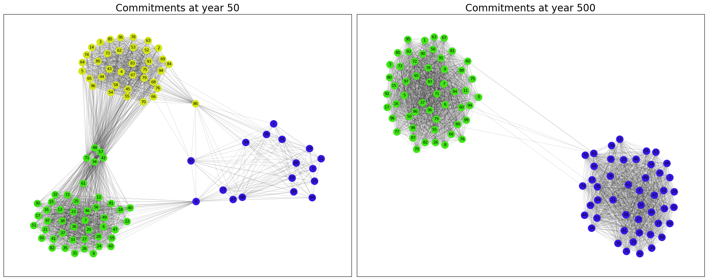

# conflictmodel
Broadly speaking, complex systems can be understood as collections of agents that interact non-trivially among themselves and their environments producing novel and rich phenomena that, typically, cannot be anticipated from the study of their individual units.  We delve into the work of the prominent social scientist Robert Axelrod whose work in social simulation has significantly advanced our understanding in complex systems. He proposed a model that describes the state formation through simple rules of interaction. As nations are no longer completely stable, we see states disintegrating, as in the Soviet Union and larger units being organized, such as the European Union. This dynamic of political actors is essential for understanding the future of global politics.  

## Abstract
In this work we implement the mathematical formulation ideas of a socio-dynamic model based on a tribute model, to simulate the interaction of elements and study the collective behaviors and the emergence of new levels of organization. The system is dynamic-coevolutionary in which states depend on local states and vice versa with discrete space and time. The research problem is to extend Axelrod’s original insights into a broader context, specifically to understand complex sociopolitical dynamics and their implications. The challenge lies in the complexity of these interactions and the need for computational tools to analyze them. In sum, What are the non-trivial collective behaviors observed in our extended and computationally implemented version of Axelrod’s model? 

## Computational Model and guidelines
We consider N agents in a network for this social simulation. The initial wealth distribution as well as the selection of the active agent are randomly selected. The target selection requires contiguity, in the network topology, with the active agent (alliances). The dynamics consist of a demand for resources with the threat of a conflict in case the defendant does not acquiesce; a case where both lose proportionally. Ideally, the perfect target should be weak enough to cause less damage if it chooses to fight and strong enough to afford to pay as much as it can afford. The target will only pay if fighting costs less than paying. 
The wealth for each coalision $W_{\alpha}$ and $W_{\tau}$ are:
        $$W_{\alpha} = \sum_{i=1}^{N_{\alpha}} C_{A i}W_{i}$$
        $$W_{\tau} = \sum_{i=1}^{N_{\tau}} C_{T i}W_{i}$$
        
in which, $N_{\alpha}$ and $N_{\tau}$ belong to coalision A and T respectively. 

Vulnerability is defined as: 

$$V_{A,j}= \frac{W_{\alpha}-W_{\tau}}{W_{\alpha}}$$

The loss of each element in a coalition is:
$$L_{i\alpha}=\kappa W_{\tau}\frac{W_{i}}{W_{\alpha}}$$,

$$L_{i\tau}=\kappa W_{\alpha}\frac{W_{i}}{W_{\tau}}$$

Finally, each decision develops degrees of commitment and influences future decisions. We establish a steady increase in commitment under "submission", "protection" and "friendship" and a decrease under "hostility", in and out of alliances. We track this history with a matrix. The commitment Matrix is and identity Matrix NxN where $M_{i,j}=C_{i,j}$ is the mutual commitment between i and j. Identifying aggregations of agents becomes more challenging due to the increasing complexity of the commitment structure. To better visualize these dynamics, we generate a graph using snapshots of the commitment matrix. We construct an adjacency matrix by establishing weighted edges between coalition members as defined by Axelrod. Then we employed the Louvain community detection algorithm to identify clusters and colored them for easy identification.

## Instructions

- 1.) conflict_model.py  This is a python script which simulates the conflict model described above by selecting a random active agent among the N independent agents, the selection of the ideal target requiring continguity is performed by applying al the conditions mentions previously. The process will iterate until the number of years selected. Additionally, the initial conditions are set out here, but are chosen for convenience. Generates history for every population
  
- 2.) simplified_tribute.py uses a new rule of target selection to speeds up the process, ensuring computational efficiency without sacrificing detail. Generates data for the phase diagram. 
- 

This work offers a computational platform for conflict simulation and resource allocation strategy in social network structures, improving our understanding of sociopolitical dynamics and their sustainability implications. 

## Contact
For questions or feedback, please contact me at [brandon.minta@yachaytech.edu.ec]
